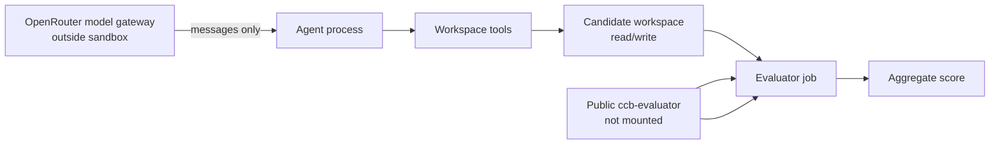

# Evaluator architecture

## Transparency model

CCB publishes the runner and active rule packs in this repository. This makes the scoring mechanism inspectable and replayable by people. It does not make the rule pack available to agents during a benchmark run: the execution environment must enforce that separation.

The benchmark therefore measures conformance under a controlled execution environment, not secrecy of the rule text.

## Required agent sandbox

The sandbox must enforce all of the following:

- candidate workspace is the only project mount available to agent tools;
- no GitHub token, SSH key, browser relay, web-search tool, or arbitrary outbound network is available to the agent;
- network access from the execution container is disabled; model requests are brokered by a host-side OpenRouter gateway, not made by the container;
- `ccb-evaluator` is not cloned, mounted, cached, or referenced in agent prompts, tool metadata, CI logs, or environment variables;
- the evaluator runs only after the candidate task is complete, on separate ephemeral compute;
- an egress-canary check proves that the sandbox cannot resolve or reach `github.com` during a benchmark run.

## Residual risk

A public rule pack can be known outside the sandbox, including through future model training or prior human disclosure. CCB must record the model version and campaign date, use fresh rule packs when this risk is material, and report this limitation with results. A public evaluator is transparent; it is not a cryptographic blind-test guarantee.

## Runner boundary

The TypeScript runner combines dependency-cruiser boundary checks with TypeScript AST metrics for maintainability, clarity, tests, and robustness. It does not execute candidate application code, install candidate dependencies, or emit raw analyzer diagnostics in its aggregate result. The runner may read a public rule pack only after the candidate agent has finished.
